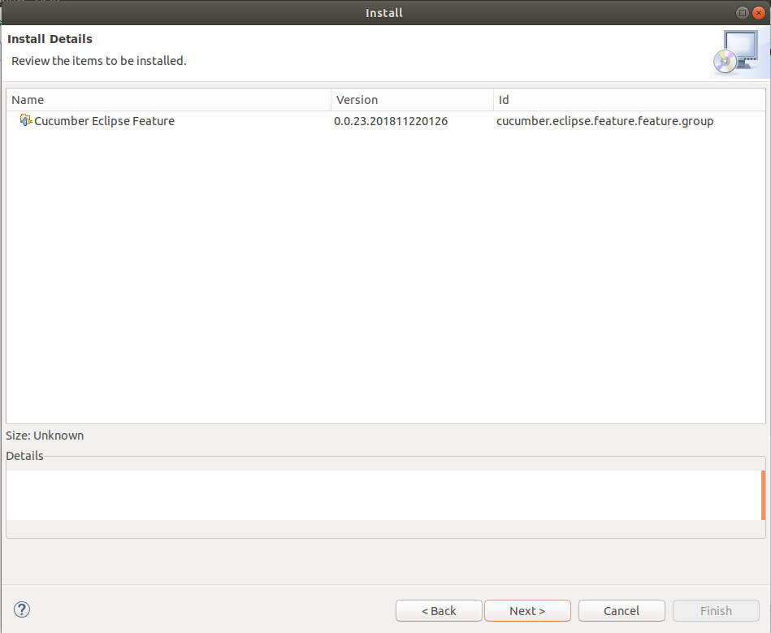

--- 
title: Eclipse Cucumber插件安装
date: 2019-02-26 22:14:28
tags:
  - cucumber
  - eclipse
---
# Eclipse Cucumber插件安装
启动Eclispe，依次选择菜单的Help >> Install New Software,进入Install对话框。
```
http://cucumber.github.com/cucumber-eclipse/update-site 
```



注意安装完成后可能弹Security Warning，点击【Install anyway】即可。

安装完成后，会提示重启Eclipse, 插件会在下次启动后生效。

# 安装后

